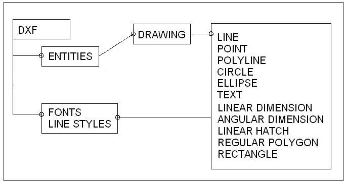



## DXFWriter v\.1\.0

### Description

DXFWriter is an object oriented ActiveX DLL for generating DXF files.

Features:

- Drawing objects: Lines, Points, Circles, Ellipses, Texts, Polylines, Arcs, Solids, Linear dimensions, angular dimensions, linear hatch, regular polygons, rectangles.

- Line styles, fonts, colors, layers.
 
### More Info
 

             |
---                |---
**Submitted On**   |2006-08-28 14:24:02
**By**             |[Athanasios Gardos](https://github.com/Planet-Source-Code/PSCIndex/blob/master/ByAuthor/athanasios-gardos.md)
**Level**          |Advanced
**User Rating**    |5.0 (35 globes from 7 users)
**Compatibility**  |VB 6\.0
**Category**       |[Graphics](https://github.com/Planet-Source-Code/PSCIndex/blob/master/ByCategory/graphics__1-46.md)
**World**          |[Visual Basic](https://github.com/Planet-Source-Code/PSCIndex/blob/master/ByWorld/visual-basic.md)
**Archive File**   |[DXFWriter\_20312811162006\.zip](https://github.com/Planet-Source-Code/athanasios-gardos-dxfwriter-v-1-0__1-67110/archive/master.zip)

